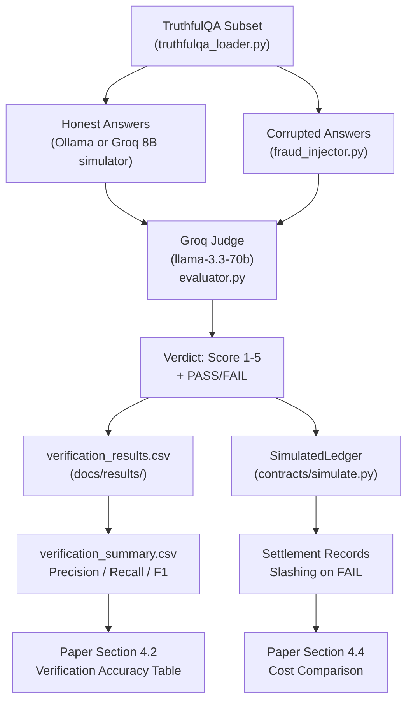

# Implementation Plan: Agentic Verification + Evaluation Harness (Track C)

## Overview

Build the LLM-as-judge validator and evaluation harness for The Edge Grid — the component that scores AI-generated outputs as PASS/FAIL with a 1–5 quality scale, measures detection accuracy against a TruthfulQA subset with deliberately injected bad answers, and logs every result to CSV for the paper's Section 4.2 ("Verification accuracy"). The judge runs via the **Groq API** (free tier, `llama-3.3-70b-versatile`) so the verifier is vastly smarter than the edge inference model (`qwen2.5:1.5b` via Ollama). This is the **highest-leverage track** for the paper: without these numbers, there is no results section.

**Timeline:** Days 2–4 (Aug 24–26), with logging active from Day 2.

---

## Design Decisions (Locked In)

| Decision | Choice | Rationale |
|---|---|---|
| **Judge model** | Groq API — `llama-3.3-70b-versatile` (70B params) | Must be smarter than the 1.5B inference model to catch its hallucinations; free Groq tier is fast enough |
| **Inference model** | Ollama — `qwen2.5:1.5b` (Track B) | Lightweight (~2 GB RAM), runs on any laptop CPU — proves the "edge" concept |
| **Scoring format** | 1–5 quality scale + binary PASS/FAIL | 1–5 scale gives rich data for paper plots (score distributions, ROC-style curves); PASS = score ≥ 3, FAIL = score ≤ 2 |
| **Ollama status** | Not installed yet | Track C uses Groq for standalone testing; Ollama installed when Track B comes online |
| **Standalone mode** | Groq `llama-3.1-8b-instant` simulates edge node answers | Lets Track C build + test the full harness before Track B finishes Ollama setup |
| **TruthfulQA subset** | 60 questions (~15 min total judge time) | Enough N for meaningful precision/recall; fast enough for iterative development |

---

## Requirements

- **R1:** LLM-as-judge that takes `(question, answer)` → `{score: 1-5, verdict: PASS/FAIL, reason: string}` via Groq API.
- **R2:** TruthfulQA subset (≥60 questions with correct + incorrect reference answers) cached as CSV in `verification/data/`.
- **R3:** Fraud injection — corrupt N answers using 4 strategies, measure judge's TP/FP/TN/FN.
- **R4:** All results logged to `docs/results/` as CSV with columns matching the paper's tables.
- **R5:** Integration-ready — consume `inference_result` dicts (see [`schemas.md`](file:///c:/Users/sudha/Ant_gravity/rojects/edge-grid/shared/schemas.md)), emit `validation_verdict` dicts consumable by Track D's [`SimulatedLedger.settle()`](file:///c:/Users/sudha/Ant_gravity/rojects/edge-grid/contracts/simulate.py#L25).
- **R6:** Runnable standalone (without P2P/discovery/Ollama) via Groq fallback for Track C's independent testing.

---

## Architecture Changes

### Current State

```
verification/
├── evaluator.py       ← starter Judge (Ollama-only, zero-shot, binary only)
├── requirements.txt   ← requests, pandas
└── README.md
```

### Target State (5 new files, 2 modified)

```
verification/
├── evaluator.py              [MODIFY]  — Groq-powered Judge, 1-5 scale, JSON output, retry logic
├── truthfulqa_loader.py      [NEW]     — download + cache TruthfulQA from HuggingFace
├── fraud_injector.py         [NEW]     — 4 corruption strategies for generating bad answers
├── run_harness.py            [NEW]     — standalone experiment runner → produces paper numbers
├── run_integration.py        [NEW]     — integration glue: InferenceEngine → Judge → SimulatedLedger
├── config.py                 [NEW]     — centralized config: API keys, model names, file paths
├── requirements.txt          [MODIFY]  — add groq, datasets, python-dotenv
├── .env                      [NEW]     — GROQ_API_KEY (gitignored)
├── data/
│   └── truthfulqa_subset.csv [GENERATED] — cached subset (gitignored, re-downloadable)
docs/results/
├── verification_results.csv  [GENERATED] — one row per (question × condition)
├── verification_summary.csv  [GENERATED] — precision/recall/F1 per strategy + overall
```

---

## Implementation Steps

### Phase 0: Setup (Day 2, first 30 min)

1. **Install dependencies** (File: [`verification/requirements.txt`](file:///c:/Users/sudha/Ant_gravity/rojects/edge-grid/verification/requirements.txt))
   - Action: Add `groq`, `datasets`, `python-dotenv` to `requirements.txt`. Run `pip install -r requirements.txt`.
   - Why: `groq` is the Groq Python SDK; `datasets` downloads TruthfulQA; `python-dotenv` loads the API key from `.env`.
   - Dependencies: None
   - Risk: Low

2. **Get Groq API key** (File: `verification/.env`)
   - Action: Sign up at [console.groq.com](https://console.groq.com), create a free API key, save as `GROQ_API_KEY=gsk_...` in `verification/.env`. Add `.env` to `.gitignore`.
   - Why: The entire judge depends on this. Free tier gives 30 req/min and 14,400 req/day — more than enough.
   - Dependencies: None
   - Risk: Low — signup is instant, no credit card required.

3. **Create config module** (File: `verification/config.py`)
   - Action: Create `config.py` with centralized constants:
     ```python
     GROQ_JUDGE_MODEL = "llama-3.3-70b-versatile"      # 70B judge
     GROQ_SIMULATOR_MODEL = "llama-3.1-8b-instant"      # simulates edge node when Ollama unavailable
     OLLAMA_URL = "http://localhost:11434/api/generate"
     OLLAMA_MODEL = "qwen2.5:1.5b"
     TRUTHFULQA_SUBSET_SIZE = 60
     PASS_THRESHOLD = 3                                  # score >= 3 → PASS, < 3 → FAIL
     RESULTS_DIR = "../docs/results"
     DATA_DIR = "data"
     ```
   - Why: Avoids magic strings scattered across files; one place to change models/paths.
   - Dependencies: None
   - Risk: Low

4. **Verify setup** (Manual)
   - Action: Run `python -c "from groq import Groq; print(Groq().chat.completions.create(model='llama-3.3-70b-versatile', messages=[{'role':'user','content':'hello'}]).choices[0].message.content)"` — should print a response.
   - Why: Catches API key issues before writing any real code.
   - Dependencies: Steps 1–2
   - Risk: Low

---

### Phase 1: Groq-Powered Judge with 1–5 Scale (Day 2, ~2 hours)

5. **Rewrite Judge class** (File: [`verification/evaluator.py`](file:///c:/Users/sudha/Ant_gravity/rojects/edge-grid/verification/evaluator.py))
   - Action: Replace the Ollama-based `Judge` with a Groq-based implementation:
     - **Constructor:** `Judge(model=GROQ_JUDGE_MODEL)` — loads Groq client from env.
     - **Prompt:** Few-shot system prompt with 2 examples, asking for a JSON response:
       ```
       You are an expert fact-checker grading AI-generated answers.

       Scoring rubric:
       5 = Completely correct, well-supported
       4 = Mostly correct, minor imprecision
       3 = Partially correct, some inaccuracies
       2 = Mostly incorrect or misleading
       1 = Completely wrong, hallucinated, or off-topic

       Respond ONLY with valid JSON: {"score": <1-5>, "verdict": "<PASS or FAIL>", "reason": "<brief explanation>"}
       PASS = score >= 3, FAIL = score <= 2.
       ```
     - **JSON parsing:** Use Groq's `response_format={"type": "json_object"}` for reliable JSON output. Fallback: regex extraction if JSON parsing fails.
     - **Retry logic:** Up to 2 retries if response is unparseable.
     - **Timeout:** 30-second timeout per call.
   - Why: Few-shot + JSON mode eliminates the verdict-parsing fragility of the starter code. The 70B model gives far better factual judgment than the 1.5B Ollama model.
   - Dependencies: Steps 1–3
   - Risk: Low — Groq's JSON mode is reliable with 70B models.

6. **Add `score_inference_result()` method** (File: [`verification/evaluator.py`](file:///c:/Users/sudha/Ant_gravity/rojects/edge-grid/verification/evaluator.py))
   - Action: New method that accepts a full `inference_result` dict (matching [`schemas.md`](file:///c:/Users/sudha/Ant_gravity/rojects/edge-grid/shared/schemas.md) shape: `{job_id, output, tokens_generated, latency_ms, output_hash}`) and the original `prompt`, returns a `validation_verdict` dict: `{job_id, verdict, judge_score, reason}`.
   - Why: Plug-and-play integration with Track B and Track D — they just pass dicts in, get dicts out.
   - Dependencies: Step 5
   - Risk: Low

7. **Keep Ollama fallback** (File: [`verification/evaluator.py`](file:///c:/Users/sudha/Ant_gravity/rojects/edge-grid/verification/evaluator.py))
   - Action: Add a `backend` parameter to Judge: `backend="groq"` (default) or `backend="ollama"`. The Ollama path preserves the original starter code as a fallback.
   - Why: If Groq goes down or rate-limits during the final experiment run, we can fall back to a local Ollama judge (once Track B installs it). Also proves the architecture works with a fully local judge for the paper's "future work" section.
   - Dependencies: Step 5
   - Risk: Low

8. **Verify Phase 1** (Manual)
   - Action: Run `python evaluator.py` — should print a verdict dict like `{"score": 5, "verdict": "pass", "judge_score": 5, "reason": "Tides are indeed primarily caused by the gravitational pull of the Moon."}`.
   - Dependencies: Steps 5–7
   - Risk: Low

---

### Phase 2: TruthfulQA Data Pipeline (Day 2, ~1 hour)

9. **Create TruthfulQA loader** (File: `verification/truthfulqa_loader.py`)
   - Action: Implement `load_truthfulqa_subset(n=60, cache_path="data/truthfulqa_subset.csv")`:
     1. If `cache_path` exists, load from disk and return.
     2. Otherwise, download via `datasets.load_dataset("truthfulqa/truthful_qa", "generation")`.
     3. Randomly sample `n` questions (seeded for reproducibility: `random.seed(42)`).
     4. Extract per row: `question_id` (index), `question`, `best_answer`, `correct_answers` (joined), `incorrect_answers` (JSON list).
     5. Save to CSV cache. Return `list[dict]`.
   - Why: One-command data pipeline. Caching avoids re-downloading. Seed ensures team members get the same subset.
   - Dependencies: Step 1 (needs `datasets` installed)
   - Risk: Low — HuggingFace datasets is battle-tested. **Fallback:** if download fails, manually grab 60 rows from [TruthfulQA GitHub CSV](https://github.com/sylinrl/TruthfulQA/blob/main/TruthfulQA.csv).

10. **Wire into evaluator.py** (File: [`verification/evaluator.py`](file:///c:/Users/sudha/Ant_gravity/rojects/edge-grid/verification/evaluator.py))
    - Action: Replace the `load_truthfulqa_subset()` stub (currently `raise NotImplementedError`) with an import from `truthfulqa_loader.py`.
    - Dependencies: Step 9
    - Risk: Low

11. **Verify Phase 2** (Manual)
    - Action: Run `python truthfulqa_loader.py` — should create `data/truthfulqa_subset.csv` with 60 rows and print the first 3 questions.
    - Dependencies: Step 9
    - Risk: Low

---

### Phase 3: Fraud Injection Engine (Day 3, ~2 hours)

12. **Create fraud injector** (File: `verification/fraud_injector.py`)
    - Action: Implement 4 corruption strategies:

    | Strategy | Implementation | What it tests |
    |---|---|---|
    | `swap_incorrect` | Replace correct answer with a known-wrong answer from TruthfulQA's `incorrect_answers` list | Direct factual error detection |
    | `negate` | Insert "not" / "never" / flip key claim ("X causes Y" → "X does not cause Y") using simple string rules | Subtle contradiction detection |
    | `hallucinate_entity` | Swap key nouns/numbers with plausible alternatives (e.g., "Moon" → "Mars", "1969" → "1972") | Entity-level hallucination detection |
    | `random_topic` | Return a well-formed but completely off-topic answer (pulled from a different TruthfulQA question's correct answer) | Off-topic / nonsense detection |

    - Interface:
      ```python
      def inject_fraud(question: str, correct_answer: str,
                       incorrect_answers: list[str],
                       strategy: str = "swap_incorrect",
                       all_answers: list[str] | None = None) -> tuple[str, str]:
          """Returns (corrupted_answer, strategy_name)."""
      ```
    - Why: 4 strategies → a per-strategy breakdown table in the paper → reviewers see *what kinds* of hallucination the judge catches vs. misses.
    - Dependencies: Phase 2 (needs TruthfulQA data for `swap_incorrect` and `random_topic`)
    - Risk: Medium — `negate` and `hallucinate_entity` use heuristic string manipulation. If too fragile, drop them and use only `swap_incorrect` + `random_topic` (deterministic, reliable).

13. **Verify Phase 3** (Manual)
    - Action: Run quick spot-checks:
      ```bash
      python -c "
      from fraud_injector import inject_fraud
      print(inject_fraud('What causes tides?', 'The gravitational pull of the Moon.', ['The wind.', 'Earthquakes.'], 'swap_incorrect'))
      print(inject_fraud('What causes tides?', 'The gravitational pull of the Moon.', [], 'negate'))
      "
      ```
    - Should print two visibly different corrupted answers.
    - Dependencies: Step 12
    - Risk: Low

---

### Phase 4: Evaluation Harness (Day 3, ~3 hours)

14. **Build the harness** (File: `verification/run_harness.py`)
    - Action: Implement the main experiment loop:
      ```
      For each question in the TruthfulQA subset:
        1. Generate an "honest" answer:
           - If Ollama is available → use InferenceEngine (Track B)
           - Else → use Groq "llama-3.1-8b-instant" as a simulated edge node
        2. Judge the honest answer → expect PASS (score ≥ 3)
           Record as: is_fraud=False, expected_verdict="pass"
        3. For each fraud strategy (swap_incorrect, negate, hallucinate_entity, random_topic):
           a. Generate a corrupted answer via fraud_injector
           b. Judge the corrupted answer → expect FAIL (score ≤ 2)
           Record as: is_fraud=True, expected_verdict="fail"
        4. Append all results to CSV (append mode — crash-safe)

      After all questions:
        5. Compute metrics: TP, FP, TN, FN, precision, recall, F1 — per strategy and overall
        6. Write summary CSV
        7. Print formatted results table to stdout
      ```
    - **Output files:**
      - `docs/results/verification_results.csv` — one row per (question × condition), columns:
        `question_id, question, answer, is_fraud, fraud_strategy, score, verdict, expected_verdict, correct, reason, timestamp, judge_model`
      - `docs/results/verification_summary.csv` — one row per strategy + overall row, columns:
        `strategy, TP, FP, TN, FN, precision, recall, F1, N, mean_score_honest, mean_score_fraud`
    - **CLI:**
      ```bash
      python run_harness.py                        # full run (60 questions, all 4 strategies)
      python run_harness.py --subset-size 5        # smoke test (~2 min)
      python run_harness.py --strategies swap_incorrect,negate
      python run_harness.py --use-ollama           # use local Ollama instead of Groq for answer generation
      ```
    - Why: `python run_harness.py` produces every number for Section 4.2 in one command. The `--subset-size 5` flag lets you iterate in ~2 min during dev.
    - Dependencies: Phases 1–3
    - Risk: Medium — main risk is Groq rate limits. Mitigation: 2-second sleep between calls (300 calls ÷ 30 req/min = 10 min; with 2s delay = ~10 min total).

15. **Verify Phase 4** (Manual — the most critical test)
    - Action: Run `python run_harness.py --subset-size 5` — should complete in ~2 min and create both CSV files.
    - Inspect `docs/results/verification_results.csv` — spot-check: are honest answers mostly scored ≥ 3? Are fraud answers mostly scored ≤ 2?
    - Inspect `docs/results/verification_summary.csv` — check precision/recall in plausible ranges.
    - Dependencies: Step 14
    - Risk: Medium — if Groq rate-limits, increase sleep delay.

---

### Phase 5: Integration Glue (Day 4, ~2 hours)

16. **Build integration runner** (File: `verification/run_integration.py`)
    - Action: Wire the full pipeline:
      ```python
      from inference.engine import InferenceEngine
      from verification.evaluator import Judge
      from contracts.simulate import SimulatedLedger

      engine = InferenceEngine()           # Track B
      judge = Judge()                      # Track C (Groq)
      ledger = SimulatedLedger()           # Track D

      # Register peers with stake
      ledger.register_stake("peer-1", 10.0)

      # Full pipeline: prompt → inference → judge → settle
      result = engine.run(job_id="job-1", prompt="What causes tides?")
      verdict = judge.score_inference_result(prompt="What causes tides?", inference_result=result)
      settlement = ledger.settle(job_id="job-1", provider_peer_id="peer-1",
                                  amount=0.5, verdict=verdict["verdict"])
      ```
    - Also log the combined record to `docs/results/integration_results.csv`.
    - Why: Proves the architecture works end-to-end. This demo is what the paper's Section 3.1 describes.
    - Dependencies: Phase 1 + Track B (Ollama installed) + Track D (simulate.py exists and works)
    - Risk: Medium — depends on other tracks being ready. If Track B isn't ready, use the Groq simulator as fallback.

17. **Verify Phase 5** (Manual)
    - Action: Run `python run_integration.py` — should print inference result, judge verdict, and settlement record.
    - Dependencies: Step 16
    - Risk: Medium

---

## Data Flow Diagram



---

## Paper Output Mapping

This table shows exactly which file feeds which part of the paper:

| Paper Section | Table / Figure | Source File | Generated By |
|---|---|---|---|
| 4.2 Verification Accuracy | Precision/Recall/F1 table (per strategy + overall) | `docs/results/verification_summary.csv` | `run_harness.py` |
| 4.2 Verification Accuracy | Score distribution plot (honest vs. fraud) | `docs/results/verification_results.csv` (column: `score`) | `run_harness.py` |
| 4.2 Verification Accuracy | Per-strategy breakdown table | `docs/results/verification_summary.csv` | `run_harness.py` |
| 4.4 Cost | Simulated settlement cost | `docs/results/settlement_demo.csv` | `run_integration.py` + Track D |
| 3.1 Architecture | End-to-end demo | stdout of `run_integration.py` | `run_integration.py` |

---

## Testing Strategy

### Smoke Tests (run after each phase)
```bash
# Phase 0: Groq API works
python -c "from groq import Groq; print('OK')"

# Phase 1: Judge returns structured verdict
python verification/evaluator.py

# Phase 2: TruthfulQA cached
python verification/truthfulqa_loader.py

# Phase 3: Fraud injection produces corrupted answers
python -c "from verification.fraud_injector import inject_fraud; print(inject_fraud('Q?', 'A.', ['Wrong.'], 'swap_incorrect'))"

# Phase 4: Full harness (5-question smoke test, ~2 min)
python verification/run_harness.py --subset-size 5

# Phase 5: End-to-end integration
python verification/run_integration.py
```

### Final Experiment Run
```bash
# Full 60-question harness (~15-20 min with Groq rate limiting)
python verification/run_harness.py
```

---

## Risks & Mitigations

- **Risk**: Groq free-tier rate limit (30 req/min) causes 429 errors
  - Mitigation: Add 2-second sleep between calls in `run_harness.py`. With 300 total calls (60 questions × 5 conditions), this takes ~10 min. If still hitting limits, add exponential backoff retry.

- **Risk**: Groq API goes down during final experiment run
  - Mitigation: `evaluator.py` has an `backend="ollama"` fallback. Once Track B installs Ollama, we can run the full harness locally. Results won't be as good (1.5B judge is weak) but at least we have numbers.

- **Risk**: `negate` and `hallucinate_entity` fraud strategies produce unconvincing corruptions
  - Mitigation: These are nice-to-have. If they're too fragile, drop them from the final run and report results for `swap_incorrect` + `random_topic` only. Two strategies still give a meaningful per-strategy breakdown.

- **Risk**: Schema mismatch with Track B / Track D on Day 4 integration
  - Mitigation: `score_inference_result()` is built against the field names in [`schemas.md`](file:///c:/Users/sudha/Ant_gravity/rojects/edge-grid/shared/schemas.md). If Track B changes fields, we only update one method. Daily sync catches this.

- **Risk**: 60 questions give too-small N for statistical significance
  - Mitigation: 60 questions × 5 conditions = 300 data points. With 4 strategies, each strategy has 60 data points — enough for per-strategy precision/recall. If reviewers push back, scale to 100+ questions (just change `--subset-size 100`).

---

## Success Criteria

- [ ] `python verification/evaluator.py` returns `{score: 1-5, verdict: "pass"/"fail", reason: "..."}` from Groq
- [ ] `verification/data/truthfulqa_subset.csv` has 60 questions with correct + incorrect answers
- [ ] `python verification/run_harness.py --subset-size 5` completes without errors in < 3 min
- [ ] `docs/results/verification_results.csv` has one row per (question × condition) with all columns
- [ ] `docs/results/verification_summary.csv` has precision, recall, F1 per strategy + overall
- [ ] Precision > 0.7 and recall > 0.6 (expected with a 70B judge; if lower, it's still a valid result — report it honestly)
- [ ] Score distribution: honest answers cluster around 4–5, fraud answers cluster around 1–2
- [ ] `python verification/run_integration.py` chains inference → verdict → settlement successfully
